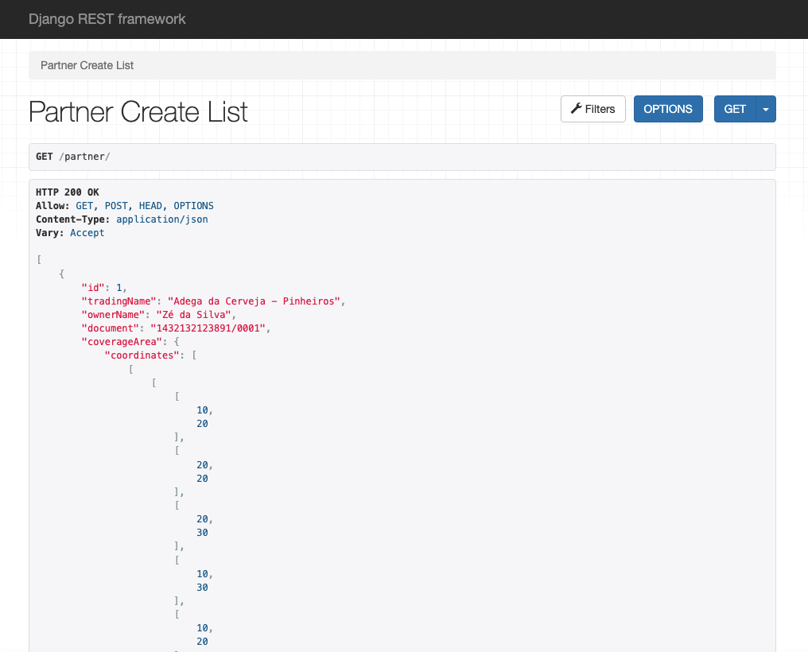
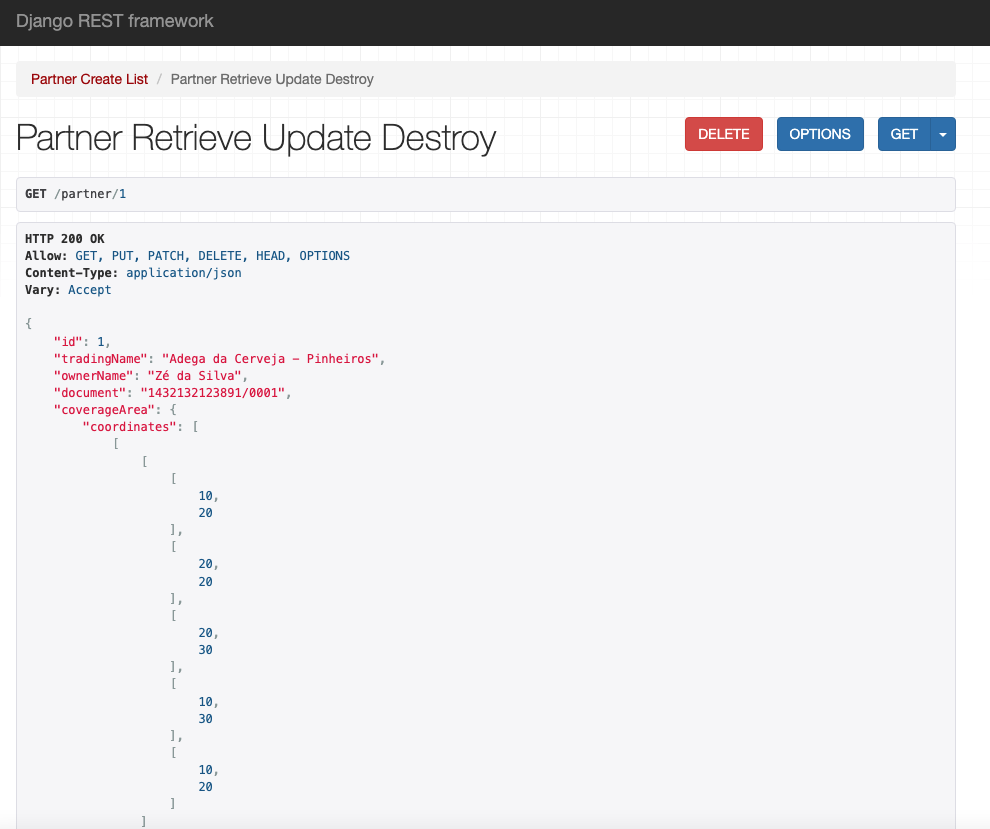
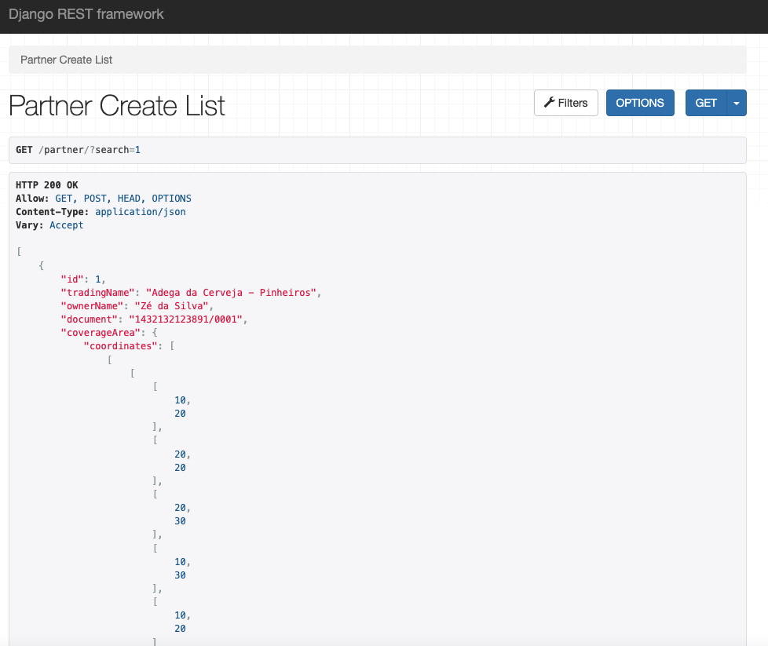
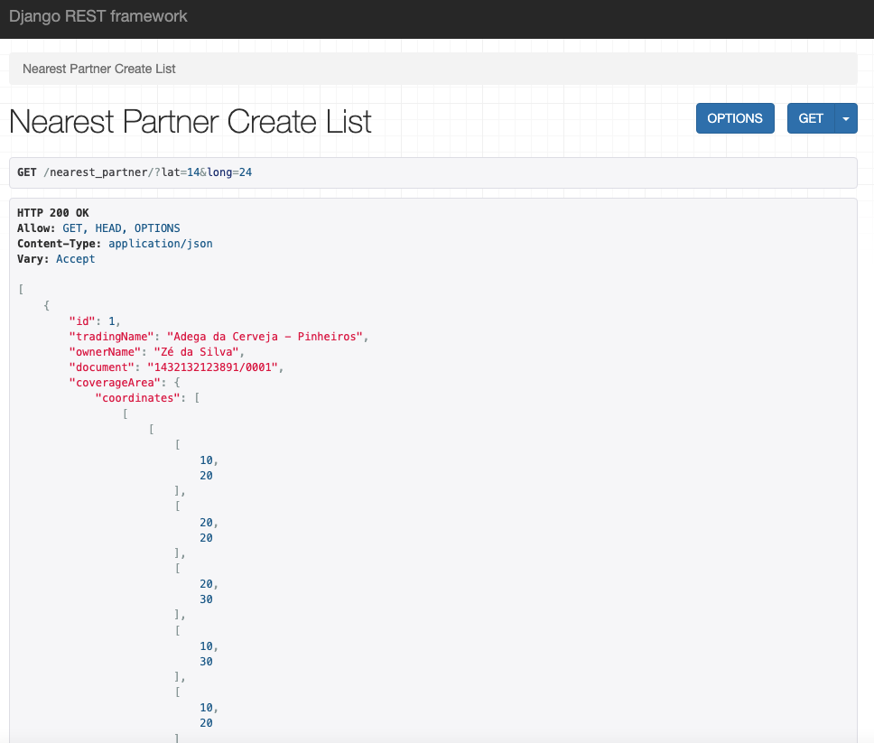
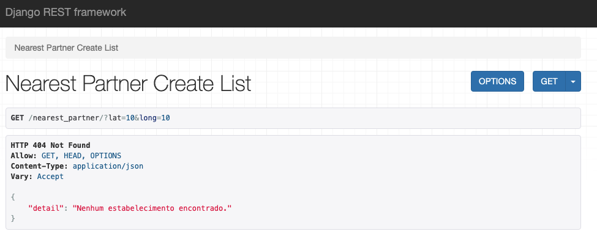

# Desafio ZéDelivery API

# Sobre o projeto [PT-BR]

O projeto Backend proposto como desafio pelo Zé consiste em criar  um serviço que disponibilize uma API REST
que implemente funcionalidades e requisitos técnicos descritos pelo link: https://github.com/ZXVentures/ze-code-challenges/blob/master/backend_pt.md

Nesse projeto foi utilizado Django REST framework e foram atendidos os tópicos:
### 1. Criar um parceiro:
Salvar no banco de dados **todas** as seguintes informações representadas por este JSON junto com as regras subsequentes:
```json
{
  "id": 1, 
  "tradingName": "Adega da Cerveja - Pinheiros",
  "ownerName": "Zé da Silva",
  "document": "1432132123891/0001",
  "coverageArea": { 
    "type": "MultiPolygon", 
    "coordinates": [
      [[[30, 20], [45, 40], [10, 40], [30, 20]]], 
      [[[15, 5], [40, 10], [10, 20], [5, 10], [15, 5]]]
    ]
  },
  "address": { 
    "type": "Point",
    "coordinates": [-46.57421, -21.785741]
  }
}
```

1. O campo `address` (endereço em inglês) segue o formato `GeoJSON Point` (https://en.wikipedia.org/wiki/GeoJSON);
2. o campo `coverageArea` (área de cobertura em inglês) segue o formato `GeoJSON MultiPolygon` (https://en.wikipedia.org/wiki/GeoJSON);
3. O campo `document` deve ser único entre os parceiros;
4. O campo `id` deve ser único entre os parceiros, mas não necessariamente um número inteiro;


### 2. Carregar parceiro pelo `id`:
Retornar um parceiro específico baseado no seu campo `id` com todos os campos apresentados acima.

### 3. Buscar parceiro:
Dada uma localização pelo usuário da API (coordenadas `long` e `lat`), procure o parceiro que esteja **mais próximo** e **que cuja área de cobertura inclua** a localização.


# Tecnologias utilizadas
## Back end
- Python
- Django REST framework
- Banco de dados: SQLite

# Como executar o projeto

## Back end
Pré-requisitos: Django e Python

```bash
# clonar repositório
git clone https://github.com/AllanGomesCorrea/Desafio_ZeDelivery_API.git

# criar o virtual environment
python3 -m venv venv

# ativar a venv (Linux,macOS)
source venv/bin/activate

# ativar a venv (Windows)
venv\Scripts\activate

# executar o comando para instalação das versões
pip install -r ./requirements.txt

# executar o projeto
python manage.py makemigrations
python manage.py migrate
python manage.py runserver
```

# Resultado

Através do Django foi possível testar localmente e obter os resultados utlizando o endereço http://127.0.0.1:8000/partner/

É possível utilizar o método POST para cadastrar através dos .JSON disponibilizados. Além disso o método GET fornece a lista completa de parceiros cadastrados.


Para retornar um parceiro específico pelo `id` basta introduzir após /partner/

Exemplo:


ou utilizando do botão `Filter` colocando a `id` do parceiro. Utilizando /partner/?search=`id` também resulta na busca.


Utilizando o endereço http://127.0.0.1:8000/nearest_partner/ é possível buscar um parceiro mais próximo desde que o ponto dado pelo usuário seja um ponto dentro da área de cobertura.

Se o ponto for fora de qualquer área de cobertura, nenhum resultado será encontrado. Para um ponto dentro da área, o parceiro mais próximo será buscado na base de dados cadastrada.

Para utilizar a busca, basta inserir o valor de `lat` e `long` conforme o exemplo: http://127.0.0.1:8000/nearest_partner/?lat=14&long=24


Exemplo de ponto fora da área de cobertura dos parceiros cadastrados.


# Autor

[](https://www.linkedin.com/in/allan-correa-582086186/)

Allan Gomes Corrêa


